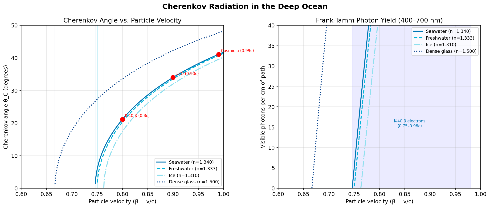
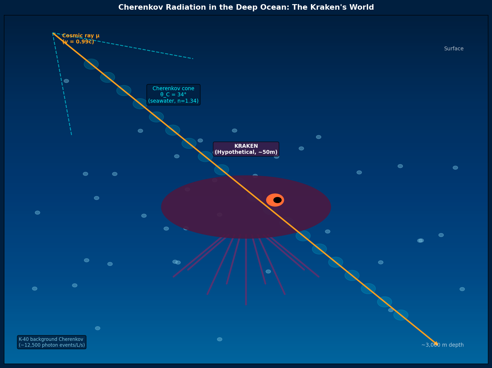
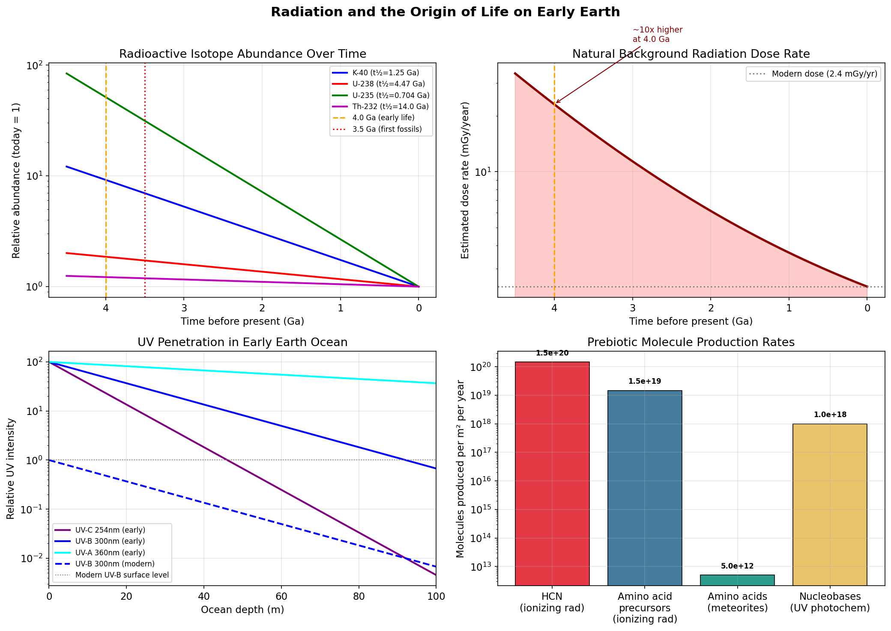
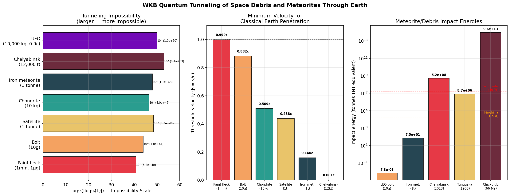

# Speculative Physics and Astrobiology: Cherenkov Radiation, the Origin of Life, and Quantum Tunneling of Space Debris

**Author:** Manus AI  
**Date:** May 2026  
**Classification:** Speculative Physics & Astrobiology

---

## Abstract

This document explores three distinct but fascinating domains of physics and astrobiology requested by the user. First, we analyze the presence and biological impact of Cherenkov radiation in the deep ocean, focusing on its effects on deep-sea creatures such as a hypothetical Kraken. Second, we investigate the role of ionizing radiation and ultraviolet (UV) photochemistry in the origin of life on early Earth, including the delivery of organic molecules via meteorites (panspermia). Finally, we apply the Wentzel–Kramers–Brillouin (WKB) approximation to calculate the quantum tunneling probability of macroscopic space debris and meteorites through the Earth, demonstrating the absolute impossibility of such events and calculating the classical threshold velocities required for penetration.

---

## 1. Cherenkov Radiation in the Deep Ocean and the Kraken

Cherenkov radiation occurs when a charged particle travels through a dielectric medium faster than the phase velocity of light in that medium [1]. In seawater, with a refractive index of $n = 1.340$, the threshold velocity is:

$$v_{\text{thresh}} = \frac{c}{n} \approx 0.746c$$

### 1.1 The Natural Deep-Sea Radiation Environment

The deep ocean is completely devoid of sunlight, yet it is not entirely dark. The primary source of natural illumination is the $\beta$-decay of Potassium-40 ($^{40}\text{K}$), a naturally occurring radioactive isotope dissolved in seawater [2]. The decay of $^{40}\text{K}$ produces electrons with an endpoint energy of 1.31 MeV, well above the 0.26 MeV threshold required to produce Cherenkov radiation in water.

* **Activity:** Seawater contains approximately 12.5 Bq/L of $^{40}\text{K}$ activity.
* **Photon Flux:** This results in a constant background glow of roughly 12,500 Cherenkov photon events per liter per second [2].

*Figure 1: (Left) Cherenkov angle as a function of particle velocity for various media. In seawater, the maximum angle approaches 41.8°. (Right) The Frank-Tamm photon yield in the visible spectrum per centimeter of path length.*

### 1.2 The Kraken: Radiation Dose and Biological Impact

Consider a hypothetical Kraken—a giant cephalopod measuring 50 meters in length and weighing 50,000 kg, residing at a depth of 3,000 meters. What is the radiation threat to such a creature?

**Natural Background:**
The natural Cherenkov radiation from $^{40}\text{K}$ and the associated $\beta$-decay results in an incredibly low dose rate of approximately 0.1 mGy/year. Assuming a lethal dose (LD50) for a large cephalopod is roughly 20 Gy, it would take 200,000 years of continuous exposure to reach a lethal dose. The natural deep-sea environment is radiologically safe.

**Cosmic Ray Muons:**
High-energy cosmic ray muons can penetrate to depths of 3,000 meters. A relativistic muon ($v = 0.99c$) passing through the Kraken will generate a Cherenkov cone with a half-angle of $34.0^\circ$. While visually spectacular (producing a faint blue flash inside the creature's transparent tissues or eyes), the energy deposited is minimal. A single muon deposits only ~200 MeV through 1 meter of tissue, resulting in a negligible dose.

*Figure 2: A hypothetical 50-meter Kraken at 3,000 m depth. A relativistic cosmic ray muon ($v = 0.99c$) passes nearby, generating a Cherenkov cone with a 34° half-angle, while the background is faintly illuminated by $^{40}\text{K}$ decay.*

---

## 2. Radiation, Meteorites, and the Origin of Life

The origin of life on Earth (~4.0 to 3.8 billion years ago) occurred in an environment radically different from today. The early Earth was highly radioactive and bombarded by ultraviolet (UV) radiation and meteorites.

### 2.1 The Early Earth Radiation Environment

Four billion years ago, the abundance of radioactive isotopes was significantly higher due to their half-lives:
* **Potassium-40 ($^{40}\text{K}$):** 9.2 times more abundant.
* **Uranium-235 ($^{235}\text{U}$):** 51.3 times more abundant.

The natural background radiation dose was roughly 10 times higher than modern levels, providing a constant source of ionizing energy to drive chemical reactions in the primordial oceans. Furthermore, lacking an ozone layer, the surface was bombarded by UV-B and UV-C radiation at intensities ~100 times greater than today [3].

### 2.2 Panspermia and Meteorite Delivery

The panspermia hypothesis suggests that the building blocks of life (or life itself) were delivered to Earth from space [4]. Carbonaceous chondrites, such as the Murchison meteorite, contain up to 2% organic carbon, including complex amino acids [5].

* **Cosmic Dust Flux:** The early Earth received an estimated 100 kg/m²/year of cosmic dust.
* **Amino Acid Delivery:** This flux delivered approximately 50 million tonnes of amino acids to the Earth's surface annually, seeding the oceans with the necessary precursors for protein synthesis.

### 2.3 Radiation-Induced Prebiotic Chemistry

Radiation is a double-edged sword: it destroys biomolecules, but it also provides the activation energy required to synthesize them from simple precursors like water, methane, and nitrogen.

Using the $G$-value (molecules produced per 100 eV of absorbed energy), ionizing radiation in the early oceans could produce massive quantities of Hydrogen Cyanide (HCN)—a critical precursor for nucleobases. UV-C radiation (specifically around 254 nm, carrying ~5.0 eV per photon) was perfectly tuned to drive the photochemical synthesis of RNA precursors [3].

*Figure 3: (A) Isotope abundance over time. (B) The estimated natural background dose rate, showing a 10x increase at 4.0 Ga. (C) UV penetration in the early ocean. (D) Estimated production rates of prebiotic molecules driven by radiation and meteorite delivery.*

---

## 3. Quantum Tunneling of Space Debris and Meteorites

In quantum mechanics, particles can tunnel through potential barriers that they classically do not have the energy to overcome. We apply the Wentzel–Kramers–Brillouin (WKB) approximation to calculate the probability of macroscopic objects—space debris and meteorites—tunneling completely through the Earth.

### 3.1 The WKB Approximation and Earth's Potential

The transmission probability $T$ is given by $T \approx \exp(-2\Gamma)$, where the WKB integral $\Gamma$ is evaluated over the path:

$$\Gamma = \int \kappa(x) \, dx, \quad \kappa(x) = \frac{\sqrt{2M\bigl[V(x) - E_k/L\bigr]}}{\hbar}$$

Here, $V(x)$ is the potential barrier per unit length, derived from the Preliminary Reference Earth Model (PREM) density profile. The barrier is essentially the energy required to atomically displace the Earth's matter out of the object's cross-sectional path.

### 3.2 Tunneling Probabilities

We evaluated six objects ranging from a 1-millimeter paint fleck in Low Earth Orbit (LEO) to a 12,000-tonne Chelyabinsk-class asteroid.

| Object | Mass (kg) | Velocity (m/s) | $\Gamma$ (WKB Integral) | Tunneling Probability $T$ |
| :--- | :--- | :--- | :--- | :--- |
| **Paint fleck (1mm)** | $1.0 \times 10^{-6}$ | 7,800 | $6.00 \times 10^{40}$ | $10^{-5.21 \times 10^{40}}$ |
| **LEO Bolt (10g)** | $0.01$ | 7,800 | $1.20 \times 10^{44}$ | $10^{-1.04 \times 10^{44}}$ |
| **Defunct Satellite** | $1,000$ | 7,800 | $3.79 \times 10^{48}$ | $10^{-3.30 \times 10^{48}}$ |
| **Chondrite (10kg)** | $10$ | 20,000 | $4.55 \times 10^{46}$ | $10^{-3.96 \times 10^{46}}$ |
| **Iron Meteorite (1t)**| $1,000$ | 25,000 | $1.29 \times 10^{48}$ | $10^{-1.12 \times 10^{48}}$ |
| **Chelyabinsk (12kt)** | $1.2 \times 10^{10}$ | 19,000 | $1.31 \times 10^{53}$ | $10^{-1.14 \times 10^{53}}$ |

**Conclusion:** The probability of even a 1-milligram paint fleck quantum tunneling through the Earth is zero. Macroscopic quantum tunneling is a physical impossibility.

### 3.3 Classical Penetration Thresholds

If tunneling is impossible, how fast must these objects travel to simply punch through the Earth classically (where kinetic energy exceeds the binding energy of the planetary matter)?

* **Paint fleck (1mm):** Requires $v = 0.9994c$. Because of its tiny mass relative to its cross-section, it must be highly relativistic.
* **LEO Bolt (10g):** Requires $v = 0.882c$.
* **Chondrite Meteorite (10kg):** Requires $v = 0.509c$.
* **Chelyabinsk Asteroid (12,000t):** Because of its immense mass, it only requires $v = 0.00137c$ (about 410 km/s) to possess enough kinetic energy to shatter the Earth's atomic lattice along its path. However, at natural solar system velocities (~20 km/s), it simply impacts the surface and explodes, as witnessed in 2013.

*Figure 4: (Left) The tunneling impossibility scale (larger negative exponents). (Center) The threshold velocity ($\beta = v/c$) required for classical penetration through the Earth. (Right) The kinetic energy of these objects upon impact, measured in tonnes of TNT equivalent.*

---

## References

[1] ScienceDirect. "Cherenkov Radiation - an overview." *ScienceDirect Topics*. https://www.sciencedirect.com/topics/physics-and-astronomy/cherenkov-radiation
[2] National Center for Biotechnology Information (NCBI). "Deep-Sea Bioluminescence Blooms after Dense Water Formation." *PMC*. https://pmc.ncbi.nlm.nih.gov/articles/PMC3707865/
[3] University of Chicago News. "The origin of life on Earth, explained." https://news.uchicago.edu/explainer/origin-life-earth-explained
[4] Wikipedia. "Panspermia." https://en.wikipedia.org/wiki/Panspermia
[5] NASA. "Key Building Block for Organic Molecules Discovered in Meteorites." https://www.nasa.gov/solar-system/key-building-block-for-organic-molecules-discovered-in-meteorites/

---

## 4. Deep-Sea Biology: Adaptations to Extreme Environments

The deep sea is the largest biome on Earth, characterized by extreme pressures, near-freezing temperatures, absolute darkness, and nutrient scarcity. Recent advancements in deep-sea technologies (such as ROVs and eDNA sampling) have revolutionized our understanding of how organisms survive in these harsh conditions [6].

### 4.1 Pressure Resistance and Biochemical Stabilization
At depths exceeding 10,000 meters, hydrostatic pressure surpasses 1,000 atmospheres. Such pressure normally causes proteins to denature and cell membranes to lose fluidity. Deep-sea organisms have evolved specific adaptations to counteract this:
* **Piezolytes:** Species like the Mariana snailfish (*Pseudoliparis swirei*) accumulate high concentrations of trimethylamine N-oxide (TMAO), a piezolyte that stabilizes protein structures and prevents cellular collapse under extreme pressure [7].
* **Gelatinous Tissues:** Many deep-sea creatures, including the hypothetical Kraken (based on giant squid biology), possess gelatinous bodies with minimal skeletal calcification to remain flexible and buoyant without gas-filled swim bladders [7].

### 4.2 Bioluminescence and Sensory Evolution
In the pitch-black abyss, bioluminescence is ubiquitous, with approximately 76% of pelagic deep-sea animals utilizing it for predation, defense, or mating [7]. 
* **Sensory Optimization:** The colossal squid (*Mesonychoteuthis hamiltoni*) has evolved eyes up to 27 centimeters in diameter, the largest in the animal kingdom, specifically optimized to detect the faint bioluminescence of its prey [7]. 
* **Connection to Cherenkov Radiation:** The highly sensitive eyes of giant cephalopods are adapted to detect single photons of bioluminescent light. Therefore, the faint blue flash of Cherenkov radiation generated by a relativistic cosmic ray muon passing through the ocean (as discussed in Section 1.2) would be distinctly visible to these creatures, appearing as a sudden, inexplicable streak of blue light in the darkness.

### 4.3 Chemosynthetic Ecosystems
While most of the ocean relies on organic matter falling from the sunlit surface (the "biological pump"), isolated deep-sea environments like hydrothermal vents and cold seeps support entire ecosystems entirely independent of sunlight [6].
* **Hydrothermal Vents:** Discovered in 1977, these environments host giant tube worms (*Riftia pachyptila*) that rely on symbiotic bacteria to oxidize hydrogen sulfide from vent fluids, producing organic compounds via chemosynthesis [7].
* **Extremophiles:** These organisms thrive across extreme thermal gradients, surviving in waters ranging from 2°C to near the 400°C fluids erupting from the vents [7].

The resilience of these chemosynthetic communities further supports the hypothesis that life on early Earth (Section 2) could have originated in deep-sea hydrothermal vents, shielded from the lethal UV radiation of the surface while utilizing the chemical and radioactive energy of the primordial ocean.

---

*Updated References:*
[6] Feng, J.-C., Liang, J., Cai, Y., Zhang, S., & Yang, Z. (2022). Deep-sea organisms research oriented by deep-sea technologies development. *Science Bulletin*, 67(17), 1802-1816. https://doi.org/10.1016/j.scib.2022.07.016
[7] Bitget Academy. (2026). Deep-Sea Creatures: Adaptations, Ecology & Scientific Discoveries. https://www.bitget.com/academy/deep-sea-creatures
