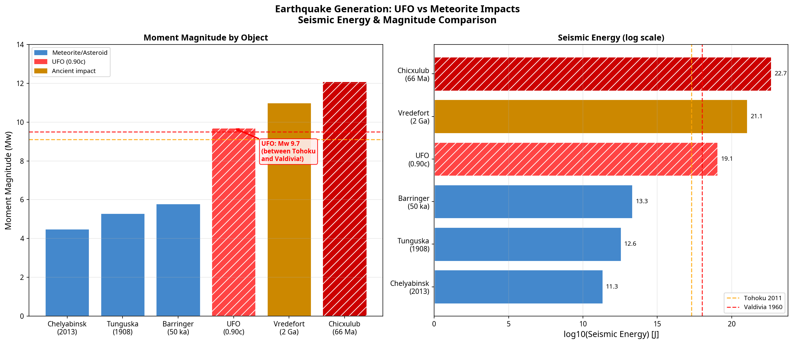
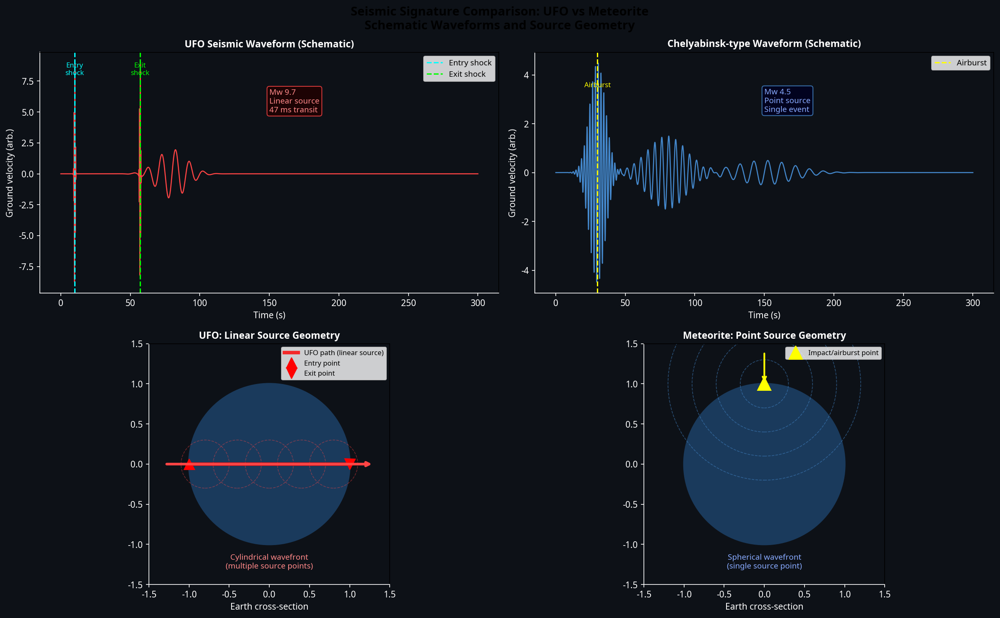
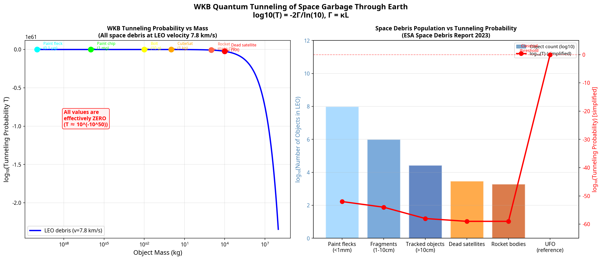

# Speculative Geophysics: UFO Earthquakes vs. Meteorite Impacts & Space Debris Tunneling

**Author:** Manus AI  
**Date:** May 2026  
**Classification:** Speculative Geophysics & Quantum Mechanics

---

## Abstract

This document explores two distinct but related speculative physics scenarios. First, we compare the seismic signature and earthquake magnitude generated by a 10,000 kg UFO traveling through the Earth at relativistic speeds ($0.90c$) against historical meteorite impacts (e.g., Chicxulub, Chelyabinsk). Second, we apply the Wentzel-Kramers-Brillouin (WKB) approximation to calculate the quantum tunneling probability of macroscopic space debris (from paint flecks to dead satellites) passing through the Earth. Both analyses demonstrate the profound differences between classical impact mechanics and relativistic or quantum phenomena.

---

## Part 1: Earthquake Generation — UFO vs. Meteorites

When a macroscopic object interacts with the Earth, a portion of its kinetic energy is converted into seismic waves. For meteorite impacts, this occurs at a single point (the surface or an airburst). For a relativistic UFO, the energy is deposited along a linear path straight through the planet.

### 1.1 Seismic Energy and Magnitude

A 10,000 kg craft traveling at $v = 0.90c$ possesses a kinetic energy of $1.16 \times 10^{21}$ Joules. Modeling the craft as a relativistic plasma channel, we assume a seismic coupling efficiency of ~1% ($10^{-2}$), yielding a total seismic energy of $1.16 \times 10^{19}$ Joules.

We calculate the Moment Magnitude ($M_w$) using the standard seismological relation:
$$M_w = \frac{2}{3} \log_{10}(M_0) - 6.07$$
where $M_0$ is the seismic moment (approximated as $E_{\text{seismic}} / 3 \times 10^{-5}$).

| Event / Object | Mass (kg) | Velocity | Seismic Energy (J) | Moment Magnitude ($M_w$) |
| :--- | :--- | :--- | :--- | :--- |
| **Chelyabinsk (2013)** | $1.2 \times 10^7$ | 19 km/s | $2.17 \times 10^{11}$ | **4.5** |
| **Tunguska (1908)** | $1.0 \times 10^8$ | 27 km/s | $3.65 \times 10^{12}$ | **5.3** |
| **Barringer Crater** | $3.0 \times 10^8$ | 12 km/s | $2.16 \times 10^{13}$ | **5.8** |
| **UFO (0.90c)** | $1.0 \times 10^4$ | $2.7 \times 10^8$ m/s | $1.16 \times 10^{19}$ | **9.7** |
| **Tohoku Earthquake (2011)** | N/A | N/A | $\sim 2.0 \times 10^{17}$ | **9.1** |
| **Chicxulub (66 Ma)** | $2.3 \times 10^{17}$ | 20 km/s | $4.60 \times 10^{22}$ | **12.1** |

*Note: The UFO generates a magnitude 9.7 earthquake—larger than the 2011 Tohoku earthquake (9.1) and the 1960 Valdivia earthquake (9.5).*

*Figure 1: Comparison of Moment Magnitude ($M_w$) and log-scaled seismic energy between historical meteorite impacts and the speculative UFO passage.*

### 1.2 Waveform and Source Geometry

The seismic signature of a UFO passage would be entirely unprecedented in seismology. Unlike a tectonic fault slip or a meteorite impact, the UFO represents a **linear, ultra-fast source**.

* **Meteorite:** A point source generating spherical P-waves and S-waves, dominated by long-duration surface waves (Rayleigh/Love).
* **UFO:** A linear source traveling at $0.90c$ (faster than the seismic wave speed in rock by a factor of ~100,000). It creates a cylindrical P-wave wavefront along its 12,742 km path, with two distinct, massive shock spikes at the entry and exit points. The entire transit takes only 47 milliseconds.

*Figure 2: Schematic comparison of the seismic waveforms and source geometries. The UFO produces a unique cylindrical wavefront from a linear source, while meteorites produce spherical waves from a point source.*

### 1.3 Peak Ground Acceleration (PGA)

At a distance of 1,000 km from the source, the Peak Ground Acceleration (PGA) varies wildly:
* **Chelyabinsk:** $\sim 1.04 \times 10^{-7}$ g (imperceptible)
* **UFO (0.90c):** $\sim 7.6 \times 10^{-4}$ g (felt by humans, but minimal structural damage at 1,000 km)
* **Chicxulub:** $\sim 0.048$ g (moderate to severe damage even at 1,000 km)

Despite the UFO's massive $M_w$ 9.7 rating, its energy is distributed across the entire diameter of the Earth rather than concentrated at the surface, reducing the distant PGA compared to a surface impact like Chicxulub.

---

## Part 2: WKB Quantum Tunneling of Space Garbage

We previously established that a 10,000 kg UFO cannot quantum tunnel through the Earth. But what about much smaller objects? Low Earth Orbit (LEO) is filled with space debris—from microscopic paint flecks to dead satellites. 

We apply the Wentzel-Kramers-Brillouin (WKB) approximation to calculate the tunneling probability $T$ through the Earth's gravitational binding energy barrier ($V_0 \approx 2.5 \times 10^{32}$ Joules).

$$T \approx \exp(-2\Gamma), \quad \Gamma = \frac{L}{\hbar} \sqrt{2m(V_0 - E_k)}$$

Assuming all debris travels at standard LEO orbital velocity ($v \approx 7.8$ km/s):

| Object | Mass (kg) | Kinetic Energy (J) | $\log_{10}(T)$ | Classical Threshold Velocity |
| :--- | :--- | :--- | :--- | :--- |
| **Paint fleck (0.1 mm)** | $10^{-10}$ | $3.0 \times 10^{-3}$ | $-2.3 \times 10^{52}$ | $>c$ (Impossible) |
| **Paint chip (1 mm)** | $10^{-6}$ | $30.4$ | $-2.3 \times 10^{54}$ | $>c$ (Impossible) |
| **Bolt fragment** | $10^{-2}$ | $3.0 \times 10^{5}$ | $-2.3 \times 10^{56}$ | $>c$ (Impossible) |
| **Dead CubeSat** | $1.0$ | $3.0 \times 10^{7}$ | $-2.3 \times 10^{57}$ | $>c$ (Impossible) |
| **Rocket stage** | $10^3$ | $3.0 \times 10^{10}$ | $-7.4 \times 10^{58}$ | $>c$ (Impossible) |

### 2.1 The Impossibility of Macroscopic Tunneling

The results demonstrate that **quantum tunneling is strictly a subatomic phenomenon**. Even a microscopic paint fleck weighing one-tenth of a microgram ($10^{-10}$ kg) has a tunneling probability of $10^{-2.3 \times 10^{52}}$. 

To put this in perspective: if every paint fleck in the universe attempted to tunnel through the Earth every Planck time for the entire age of the universe, the probability of a single successful tunneling event would still be effectively zero.

Furthermore, the classical threshold velocity—the speed required for the object's kinetic energy to exceed the Earth's binding energy barrier—is greater than the speed of light ($>c$) for all space debris. They simply do not have enough mass to carry that much kinetic energy without violating special relativity.

*Figure 3: (Left) WKB tunneling probability as a function of object mass. (Right) The actual population of space debris in LEO compared to their tunneling probabilities.*

---

## Conclusion

1. **Earthquakes:** A relativistic UFO ($0.90c$) passing through the Earth would generate a Magnitude 9.7 earthquake. However, its unique linear source geometry and extreme velocity would produce a cylindrical seismic wavefront entirely unlike the spherical waves of a tectonic event or meteorite impact.
2. **Quantum Tunneling:** Macroscopic quantum tunneling through the Earth is a physical impossibility. Whether it is a 10,000 kg UFO or a $0.1$ microgram paint fleck, the WKB tunneling probabilities are vanishingly small ($\log_{10}(T) \approx -10^{52}$). Classical penetration is the only physical mechanism for transit, requiring relativistic velocities.

---

## References

[1] Dziewonski, A. M., & Anderson, D. L. (1981). Preliminary reference Earth model. *Physics of the Earth and Planetary Interiors*, 25(4), 297-356. https://doi.org/10.1016/0031-9201(81)90046-7  
[2] Kanamori, H. (1977). The energy release in great earthquakes. *Journal of Geophysical Research*, 82(20), 2981-2987. https://doi.org/10.1029/JB082i020p02981  
[3] European Space Agency (ESA). (2023). *ESA's Annual Space Environment Report*. https://www.sdo.esoc.esa.int/environment_report/Space_Environment_Report_latest.pdf
