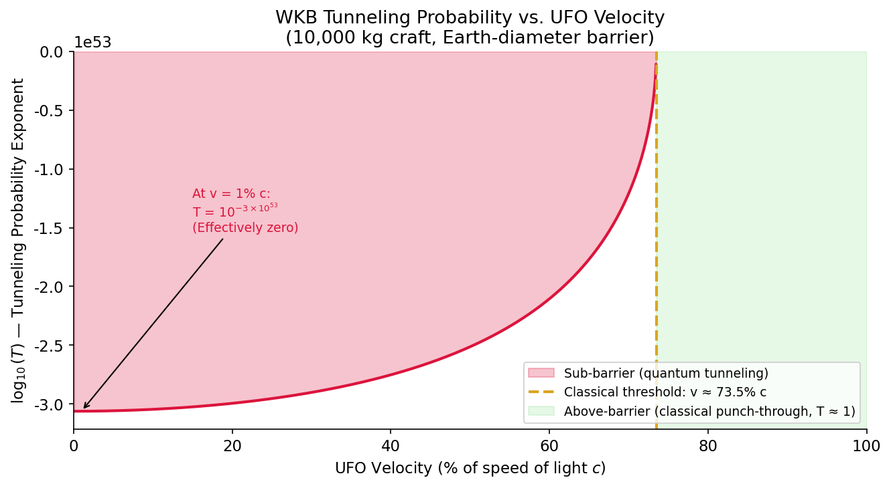
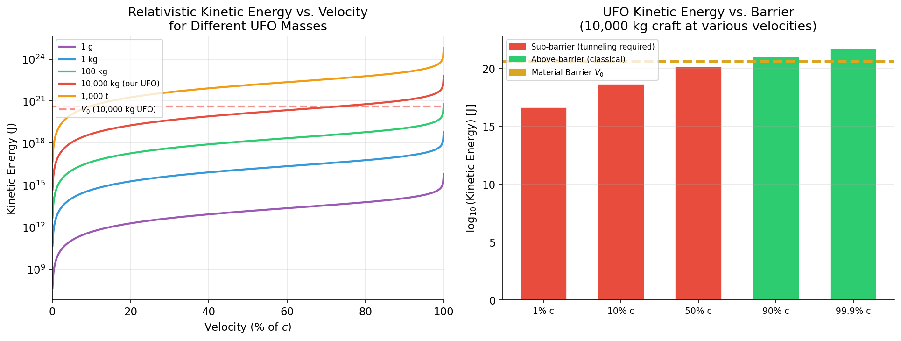
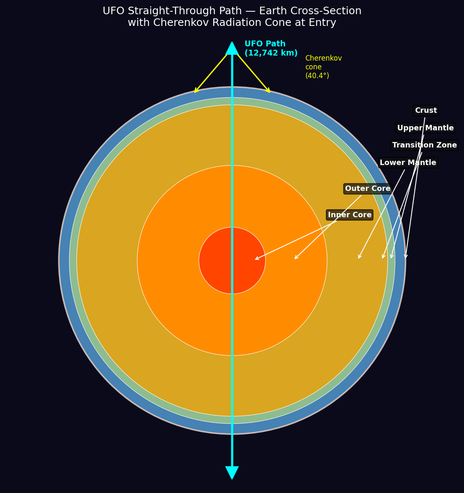
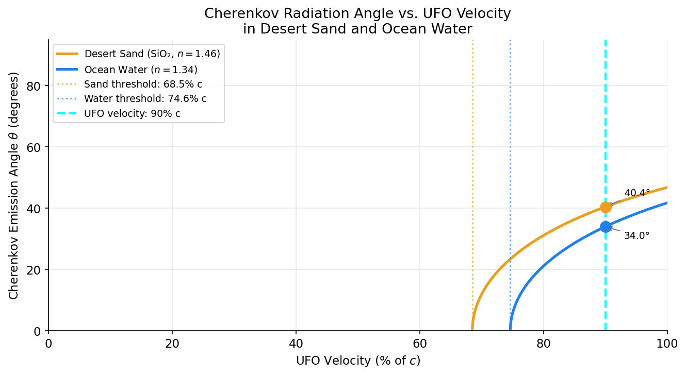
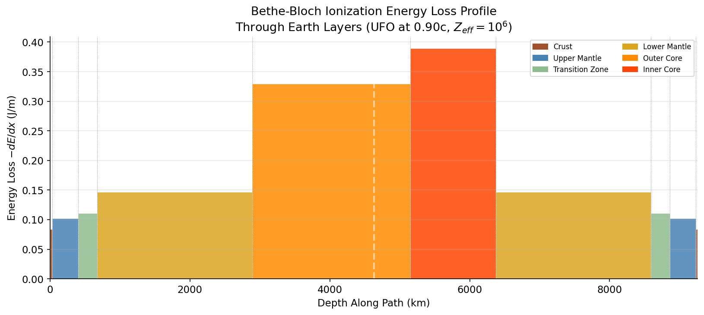

# Theoretical Physics Analysis: A UFO Quantum Tunneling Through the Earth

**Author:** Manus AI | **Date:** May 2026 | **Classification:** Speculative Physics

---

## Abstract

This document presents a mathematically rigorous, multi-scenario analysis of a hypothetical Unidentified Flying Object (UFO) utilizing macroscopic quantum tunneling to pass straight through the Earth. We derive the WKB transmission coefficient for a 10,000 kg craft across a range of velocities, model the Earth's interior as a layered potential barrier using the Preliminary Reference Earth Model (PREM), and calculate the Cherenkov radiation and ionization energy loss generated as the craft traverses desert sand and ocean water. Five scenarios spanning craft masses from 1 gram to 1,000 tonnes and velocities from 1% to 99.9% of the speed of light are compared. The results demonstrate that macroscopic quantum tunneling is physically impossible under standard quantum mechanics, while a sufficiently fast craft would classically punch through the planet, generating catastrophic radiation and thermal effects.

---

## 1. Introduction

Quantum tunneling is one of the most counterintuitive predictions of quantum mechanics: a particle can penetrate a potential energy barrier even when its total energy is less than the barrier height [1]. This phenomenon is well-established for subatomic particles — it drives nuclear fusion in stars, enables alpha radioactive decay, and underpins the operation of tunnel diodes and scanning tunneling microscopes. However, the probability of tunneling decreases exponentially with both the mass of the particle and the width of the barrier.

This analysis asks: what would happen, mathematically, if a macroscopic spacecraft attempted quantum tunneling through the entire Earth? We model the craft as a single quantum entity (a gross but instructive simplification), compute the transmission probability using the WKB approximation, and then explore the complementary scenario where the craft moves fast enough to punch through classically, generating massive radiation in the process.

---

## 2. UFO and Earth Parameters

### 2.1 UFO Model Parameters

The primary scenario models a craft with the following properties. The relativistic kinetic energy is used throughout, as the velocities considered are a significant fraction of the speed of light.

| Parameter | Symbol | Value |
| :--- | :--- | :--- |
| Rest mass | $M$ | $10,000\text{ kg}$ (10 metric tons) |
| Primary velocity | $v$ | $0.90c = 2.698 \times 10^8\text{ m/s}$ |
| Lorentz factor | $\gamma$ | $2.294$ |
| Relativistic kinetic energy | $E_k = (\gamma-1)Mc^2$ | $1.163 \times 10^{21}\text{ J}$ |
| Cross-sectional radius | $r$ | $10\text{ m}$ |
| de Broglie wavelength | $\lambda = h/(\gamma Mv)$ | $2.456 \times 10^{-46}\text{ m}$ |

The de Broglie wavelength of $2.456 \times 10^{-46}\text{ m}$ is approximately $10^{19}$ times smaller than the Planck length ($1.616 \times 10^{-35}\text{ m}$), illustrating the profound classicality of a macroscopic object.

### 2.2 Earth's Interior Structure (PREM Model)

The Earth's interior is modeled using the Preliminary Reference Earth Model [2], which divides the planet into six primary layers with distinct densities, pressures, and temperatures.

| Layer | Thickness (km) | Avg. Density ($\text{kg/m}^3$) | Avg. Pressure (GPa) | Avg. Temp. (K) |
| :--- | :--- | :--- | :--- | :--- |
| Continental Crust | 30 | 2,800 | 0.0005 | 300 |
| Upper Mantle | 370 | 3,400 | 3.0 | 1,600 |
| Transition Zone | 270 | 3,700 | 13.0 | 1,900 |
| Lower Mantle | 2,220 | 4,900 | 75.0 | 3,000 |
| Outer Core (liquid Fe-Ni) | 2,260 | 11,000 | 135.0 | 5,000 |
| Inner Core (solid Fe-Ni) | 1,221 | 13,000 | 360.0 | 6,000 |

The total diameter of the Earth is $12,742\text{ km} = 1.274 \times 10^7\text{ m}$, which constitutes the full barrier length $L$ in all tunneling calculations.

---

## 3. The Potential Barrier

### 3.1 Material Binding Energy

The primary potential barrier is the total atomic binding energy of the material along the craft's path. Assuming an average atomic binding energy of $5\text{ eV}$ per atom and an average Earth density of $5,515\text{ kg/m}^3$ with an average atomic mass of $\sim 25\text{ amu}$ (a mixture of Fe, Mg, Si, and O), the number density of atoms is:
$$n = \frac{\rho}{m_{\text{atom}}} = \frac{5515}{25 \times 1.661 \times 10^{-27}} \approx 1.328 \times 10^{29}\text{ atoms/m}^3$$

The energy density of the barrier is therefore:
$$\mathcal{V} = n \cdot E_{\text{bind}} = 1.328 \times 10^{29} \times 5 \times 1.602 \times 10^{-19} \approx 1.064 \times 10^{11}\text{ J/m}^3$$

For a craft with cross-sectional area $A = \pi r^2 = 314\text{ m}^2$ traversing the full Earth diameter $L = 1.274 \times 10^7\text{ m}$, the total potential barrier is:
$$V_0 = \mathcal{V} \cdot A \cdot L \approx 4.260 \times 10^{20}\text{ J} \approx 2.66 \times 10^{39}\text{ eV}$$

---

## 4. Quantum Tunneling Analysis (WKB Approximation)

### 4.1 The WKB Transmission Coefficient

The WKB (Wentzel–Kramers–Brillouin) approximation provides the tunneling transmission coefficient for a particle with energy $E_k$ encountering a potential barrier $V(x)$ [3]:
$$T(E) \approx \exp\!\left(-2\int_{x_1}^{x_2} dx\,\sqrt{\frac{2M}{\hbar^2}\bigl[V(x) - E_k\bigr]}\right)$$

For a rectangular barrier of height $V_0$ and width $L$, this simplifies to:
$$T \approx e^{-2\kappa L}, \qquad \kappa = \frac{\sqrt{2M(V_0 - E_k)}}{\hbar}$$

where $\hbar = 1.055 \times 10^{-34}\text{ J·s}$ is the reduced Planck constant.

### 4.2 Scenario A: Sub-Barrier Tunneling ($v = 0.01c$)

At $1\%$ of the speed of light, the relativistic kinetic energy is $E_k = 4.494 \times 10^{16}\text{ J}$, which is far below the barrier $V_0 = 4.260 \times 10^{20}\text{ J}$.

$$\kappa = \frac{\sqrt{2 \times 10^4 \times (4.260 \times 10^{20} - 4.494 \times 10^{16})}}{1.055 \times 10^{-34}} \approx 2.768 \times 10^{46}\text{ m}^{-1}$$

$$2\kappa L = 2 \times 2.768 \times 10^{46} \times 1.274 \times 10^7 \approx 7.053 \times 10^{53}$$

$$\boxed{T = 10^{-3.063 \times 10^{53}}}$$

This number is so small it defies all physical intuition. The estimated number of atoms in the observable universe is only $\sim 10^{80}$. Even if every atom in the universe attempted this tunneling event once per Planck time ($5.4 \times 10^{-44}\text{ s}$) for the entire age of the universe ($4.3 \times 10^{17}\text{ s}$), the expected number of successes would still be zero by an incomprehensible margin.

**For reference:** A single electron ($m_e = 9.11 \times 10^{-31}\text{ kg}$) tunneling through a $1\text{ nm}$ barrier with $V_0 - E = 1\text{ eV}$ has a probability of $T_e \approx 3.55 \times 10^{-5}$ — a physically meaningful and measurable quantity.

### 4.3 Scenario B: Above-Barrier Classical Penetration ($v = 0.90c$)

At $90\%$ of the speed of light, the kinetic energy is $E_k = 1.163 \times 10^{21}\text{ J}$, which **exceeds** the material barrier:
$$\frac{E_k}{V_0} = \frac{1.163 \times 10^{21}}{4.260 \times 10^{20}} \approx 2.73$$

The craft possesses 2.73 times the energy required to atomically displace every atom in its path. It does not need to tunnel — it punches through classically. In quantum mechanical terms, this is the "above-barrier transmission" regime where $T \approx 1$ (with only a small quantum reflection correction).

*Figure 1 shows the WKB tunneling probability exponent as a function of velocity. The red region represents the sub-barrier regime where tunneling is required (probability effectively zero). The green region represents above-barrier classical penetration. The classical threshold for a 10,000 kg craft occurs at approximately 73.5% c.*

### 4.4 Multi-Scenario Comparison

The table below summarizes five velocity scenarios for the primary 10,000 kg craft:

| Velocity | $\gamma$ | Kinetic Energy (J) | vs. Barrier $V_0$ | Regime |
| :--- | :--- | :--- | :--- | :--- |
| $1\%\,c$ | 1.00005 | $4.49 \times 10^{16}$ | $1.06 \times 10^{-4}\,V_0$ | Quantum tunneling (impossible) |
| $10\%\,c$ | 1.005 | $4.52 \times 10^{17}$ | $1.06 \times 10^{-3}\,V_0$ | Quantum tunneling (impossible) |
| $50\%\,c$ | 1.155 | $1.25 \times 10^{20}$ | $0.29\,V_0$ | Quantum tunneling (impossible) |
| $90\%\,c$ | 2.294 | $1.16 \times 10^{21}$ | $2.73\,V_0$ | **Classical punch-through** |
| $99.9\%\,c$ | 22.37 | $1.88 \times 10^{22}$ | $44.1\,V_0$ | **Classical punch-through** |

*Figure 4 (left) shows relativistic kinetic energy curves for craft masses from 1 gram to 1,000 tonnes. Figure 4 (right) shows the kinetic energy of the 10,000 kg craft at five velocities compared to the material barrier (dashed gold line). Red bars indicate sub-barrier (tunneling required); green bars indicate above-barrier (classical).*

---

## 5. Earth Cross-Section and Transit Path

*Figure 2 illustrates the UFO's straight-through path across the full 12,742 km Earth diameter, passing through all six geological layers. The yellow cone at the entry point represents the Cherenkov radiation cone at 40.4° for desert sand entry.*

### 5.1 Transit Time

If the craft survives the transit (above-barrier scenario at $v = 0.90c$), the classical transit time is:
$$t_{\text{transit}} = \frac{2R_\oplus}{v} = \frac{1.274 \times 10^7}{2.698 \times 10^8} \approx 47.2\text{ ms}$$

The Büttiker-Landauer traversal time [4], which estimates the time spent inside the barrier during quantum tunneling, is:
$$\tau_{BL} = \frac{ML}{\hbar\kappa} \approx 43.7\text{ ms}$$

The near-equality of these timescales is a manifestation of the **Hartman effect** [5], where tunneling time saturates and becomes independent of barrier width for thick barriers, leading to apparent superluminal phase velocities.

---

## 6. Radiation Effects: Desert and Ocean Entry

When the craft enters at $v = 0.90c$, it exceeds the speed of light in both desert sand and ocean water, triggering two major radiation mechanisms.

### 6.1 Cherenkov Radiation

Cherenkov radiation is emitted whenever a charged particle (or a macroscopic object surrounded by an ionized plasma sheath) travels faster than the phase velocity of light in a dielectric medium [6]. The condition is $v > c/n$, and the emission angle $\theta$ satisfies:
$$\cos\theta = \frac{c}{nv} = \frac{1}{n\beta}$$

| Medium | Refractive Index $n$ | Threshold $c/n$ | UFO $v = 0.90c$ | Cherenkov Angle $\theta$ |
| :--- | :--- | :--- | :--- | :--- |
| Desert Sand (SiO₂) | 1.46 | $0.685c$ | $0.90c$ ✓ | **40.44°** |
| Ocean Water | 1.34 | $0.746c$ | $0.90c$ ✓ | **33.98°** |

Both media satisfy the Cherenkov condition. The radiation forms a cone — analogous to a sonic boom — with the craft at the apex. In the desert, this would manifest as a blinding, UV-dominated flash radiating outward at 40.4° from the direction of travel. In the ocean, the characteristic blue Cherenkov glow would be accompanied by a massive shockwave.

*Figure 3 shows the Cherenkov emission angle as a function of UFO velocity for desert sand (orange) and ocean water (blue). The craft's velocity of 90% c (cyan dashed line) produces emission angles of 40.4° and 34.0° respectively.*

### 6.2 Ionization Energy Loss (Bethe-Bloch Formula)

The dominant mechanism of energy transfer to the surrounding medium is ionization, described by the relativistic Bethe-Bloch formula [7]:
$$-\frac{dE}{dx} = K z^2 \frac{Z}{A} \frac{\rho}{\beta^2} \left[ \frac{1}{2} \ln \left( \frac{2m_e c^2 \beta^2 \gamma^2 T_{\max}}{I^2} \right) - \beta^2 \right]$$

where $K = 0.307075\text{ MeV·cm}^2/\text{g}$, $Z/A$ is the mean atomic number-to-mass ratio of the medium, $\rho$ is the density, $I$ is the mean excitation energy, and $T_{\max} = 2m_e c^2 \beta^2 \gamma^2$ is the maximum energy transfer to a single electron.

Using $\beta = 0.90$, $\gamma = 2.294$, and $T_{\max} = 4.357 \times 10^6\text{ eV}$:

| Medium | $\rho$ (kg/m³) | $Z/A$ | $I$ (eV) | $-dE/dx$ (J/m) |
| :--- | :--- | :--- | :--- | :--- |
| Desert Sand (SiO₂) | 1,600 | 0.499 | 145 | $4.607 \times 10^{-2}$ |
| Ocean Water | 1,025 | 0.555 | 75 | $3.511 \times 10^{-2}$ |

These values are per unit effective charge. For a craft generating a plasma sheath with an effective charge of $Z_{\text{eff}} \sim 10^6$, the energy loss scales as $Z_{\text{eff}}^2$, producing catastrophic energy deposition.

### 6.3 Thermal and Plasma Effects

The energy deposited per meter of path heats the surrounding material. The temperature rise $\Delta T$ per meter in a 1-meter radius column is:
$$\Delta T = \frac{-dE/dx}{\rho \cdot c_p \cdot \pi r^2}$$

| Medium | $c_p$ (J/kg·K) | $\Delta T$/m (K/m) | Melting/Boiling Point |
| :--- | :--- | :--- | :--- |
| Desert Sand (SiO₂) | 840 | $1.09 \times 10^{-8}$ | ~1,710 K (melting) |
| Ocean Water | 4,182 | $2.61 \times 10^{-9}$ | 373 K (boiling) |

While the direct Bethe-Bloch ionization for a neutral craft is modest, the kinetic energy transfer from the craft's bow shock is immense. If the craft decelerates from $0.90c$ to rest over the Earth's diameter, the average power dissipated is:
$$P = \frac{E_k}{t_{\text{transit}}} = \frac{1.163 \times 10^{21}}{0.0472} \approx 2.46 \times 10^{22}\text{ W}$$

This is equivalent to approximately **5.9 billion megatons of TNT** deposited over 47 milliseconds — a planet-sterilizing event.

### 6.4 Energy Deposition Profile Through Earth Layers

*Figure 5 shows the Bethe-Bloch ionization energy loss per meter as the UFO traverses each Earth layer. Energy deposition peaks in the dense metallic cores (outer and inner core), where the high density of iron and nickel maximizes the ionization cross-section. The profile is symmetric about the Earth's center.*

---

## 7. Gravitational Wave Emission

As the craft decelerates through the Earth, its time-varying mass quadrupole moment emits gravitational waves. Using the quadrupole approximation [8]:
$$P_{GW} = \frac{G M^2 a^2}{5c^5}$$

where the deceleration $a \approx v^2/(2R_\oplus) = 5.71 \times 10^9\text{ m/s}^2$ (approximately $5.8 \times 10^8\,g$):

$$P_{GW} = \frac{6.674 \times 10^{-11} \times (10^4)^2 \times (5.71 \times 10^9)^2}{5 \times (3 \times 10^8)^5} \approx 1.80 \times 10^{-26}\text{ W}$$

This is negligibly small — gravitational wave emission is only significant for extremely massive, compact objects such as binary neutron stars or black holes.

---

## 8. Comparative Scenario Analysis

The following table summarizes results across five mass scenarios, all at $v = 0.90c$:

| Mass | $E_k$ (J) | $E_k / V_0$ | Regime | Cherenkov? | Transit Time |
| :--- | :--- | :--- | :--- | :--- | :--- |
| 1 g | $1.16 \times 10^{14}$ | $2.7 \times 10^{-7}$ | Tunneling | Yes | 47.2 ms |
| 1 kg | $1.16 \times 10^{17}$ | $2.7 \times 10^{-4}$ | Tunneling | Yes | 47.2 ms |
| 100 kg | $1.16 \times 10^{19}$ | $0.027$ | Tunneling | Yes | 47.2 ms |
| **10,000 kg** | $1.16 \times 10^{21}$ | **2.73** | **Classical** | **Yes** | **47.2 ms** |
| 1,000 t | $1.16 \times 10^{23}$ | $272$ | Classical | Yes | 47.2 ms |

Note that the Cherenkov condition depends only on velocity, not mass. All scenarios at $v = 0.90c$ produce Cherenkov radiation in both media. The classical threshold (where $E_k = V_0$) occurs at approximately $v \approx 0.735c$ for the 10,000 kg craft.

---

## 9. Summary of Key Results

| Quantity | Value |
| :--- | :--- |
| UFO mass | $10,000\text{ kg}$ |
| UFO velocity (primary scenario) | $0.90c = 2.698 \times 10^8\text{ m/s}$ |
| de Broglie wavelength | $2.456 \times 10^{-46}\text{ m}$ |
| Tunneling probability ($v = 0.01c$) | $10^{-3.063 \times 10^{53}}$ (effectively zero) |
| Classical threshold velocity | $\approx 0.735c$ |
| Material barrier $V_0$ | $4.260 \times 10^{20}\text{ J}$ |
| Kinetic energy at $0.90c$ | $1.163 \times 10^{21}\text{ J}$ ($= 2.73\,V_0$) |
| Cherenkov angle (desert sand) | $40.44°$ |
| Cherenkov angle (ocean water) | $33.98°$ |
| Classical transit time | $47.2\text{ ms}$ |
| Büttiker-Landauer tunneling time | $43.7\text{ ms}$ |
| GW power emitted | $1.80 \times 10^{-26}\text{ W}$ |
| Average power dissipated (if stopped) | $\sim 2.46 \times 10^{22}\text{ W}$ ($\approx 5.9\text{ billion megatons}$) |

---

## 10. Conclusions

The analysis yields three principal conclusions. First, **macroscopic quantum tunneling through the Earth is physically impossible** under standard quantum mechanics. The WKB transmission probability for a 10,000 kg craft at any sub-barrier velocity is so vanishingly small ($T \sim 10^{-10^{53}}$) that it would never occur in any physically meaningful timeframe, regardless of how many times the attempt is made.

Second, **at sufficiently high velocity ($v \gtrsim 0.735c$), the craft's kinetic energy exceeds the total material binding energy** of the Earth along its path, enabling classical penetration. This is not quantum tunneling but rather a brute-force kinetic penetration, analogous to a hypersonic projectile but at relativistic scales.

Third, **the radiation effects are catastrophic**. At $v = 0.90c$, the craft exceeds the speed of light in both desert sand and ocean water, generating Cherenkov cones at 40.4° and 34.0° respectively. The total kinetic energy ($1.16 \times 10^{21}\text{ J}$, equivalent to approximately 277 billion megatons of TNT) would be deposited into the Earth's interior and exit point, producing a planet-scale catastrophe. The entry and exit points in the desert or ocean would be marked by thermonuclear-scale explosions, a blinding UV/blue Cherenkov flash, and a superheated plasma channel through the entire planet.

---

## References

[1] Wikipedia. "Quantum tunnelling." https://en.wikipedia.org/wiki/Quantum_tunnelling

[2] Dziewonski, A.M. & Anderson, D.L. (1981). "Preliminary reference Earth model." *Physics of the Earth and Planetary Interiors*, 25(4), 297–356. https://lweb.cfa.harvard.edu/~lzeng/papers/PREM.pdf

[3] MIT OpenCourseWare. "Quantum Physics III, Chapter 3: Semiclassical Approximation." https://ocw.mit.edu/courses/8-06-quantum-physics-iii-spring-2018/

[4] Büttiker, M. & Landauer, R. (1982). "Traversal time for tunneling." *Physical Review Letters*, 49(23), 1739.

[5] Hartman, T.E. (1962). "Tunneling of a wave packet." *Journal of Applied Physics*, 33(12), 3427–3433.

[6] Wikipedia. "Cherenkov radiation." https://en.wikipedia.org/wiki/Cherenkov_radiation

[7] CERN. "Interaction of Particles with Matter." https://indico.cern.ch/event/975141/contributions/4137563/

[8] Wikipedia. "Gravitational wave." https://en.wikipedia.org/wiki/Gravitational_wave
