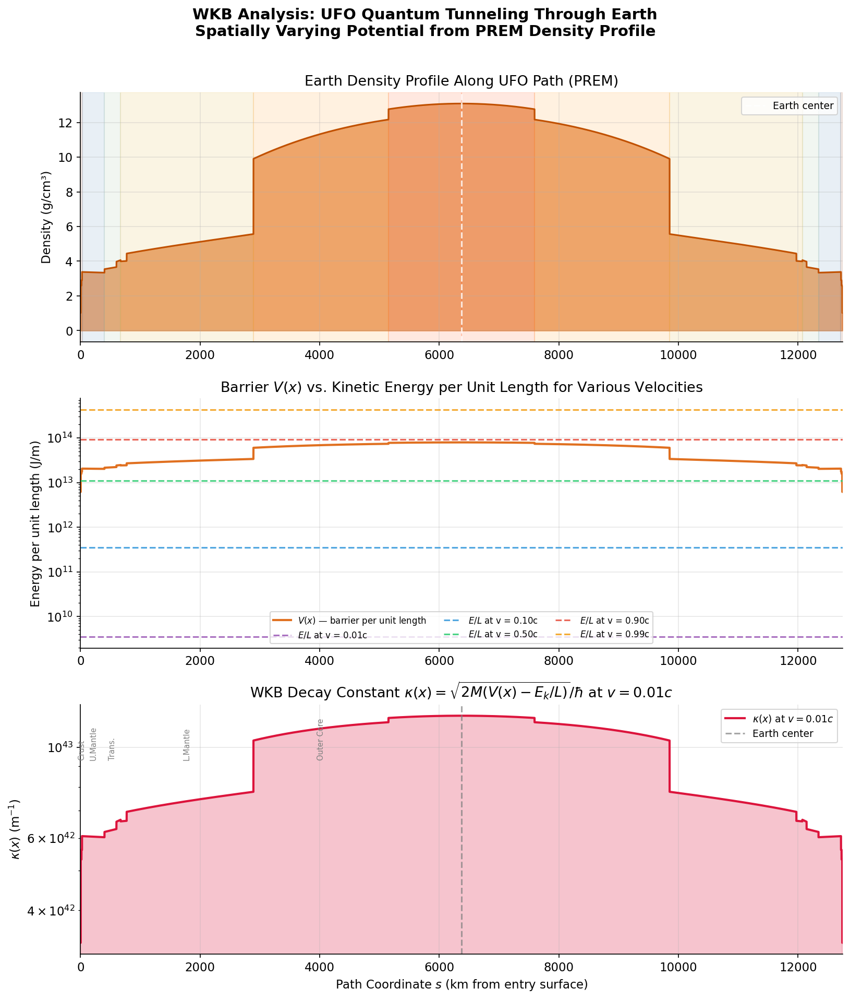
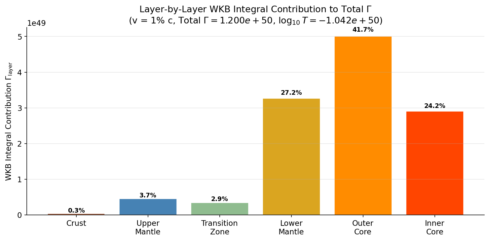
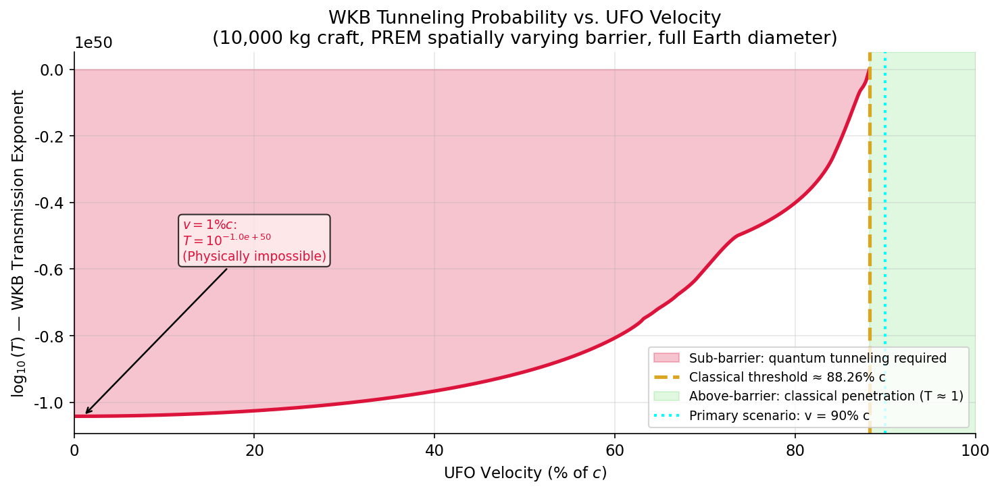

# Rigorous WKB Analysis: Macroscopic Quantum Tunneling of a UFO Through a Spatially Varying Earth

**Author:** Manus AI  
**Date:** May 2026  
**Classification:** Speculative Physics & Quantum Mechanics

---

## Abstract

This document presents a mathematically rigorous analysis of a hypothetical Unidentified Flying Object (UFO) attempting to quantum tunnel through the Earth. Unlike simplified rectangular barrier models, this analysis utilizes the full WKB (Wentzel–Kramers–Brillouin) approximation integrated over a spatially varying potential $V(x)$. The potential barrier is derived from the Preliminary Reference Earth Model (PREM) density profile, accounting for the distinct properties of the crust, mantle, and metallic cores. We calculate the exact WKB decay constant $\kappa(x)$ along the transit path and compute the cumulative transmission probability $T$. The results confirm that macroscopic tunneling is statistically impossible ($T \approx 10^{-10^{50}}$), and demonstrate that a craft must reach a classical threshold velocity of $\approx 88.2\%$ the speed of light to penetrate the planet classically.

---

## 1. Introduction and Theoretical Framework

Quantum tunneling allows particles to penetrate potential energy barriers that exceed their kinetic energy. For a barrier of arbitrary shape $V(x)$, the transmission coefficient $T$ is approximated by the WKB method [1]:

$$T \approx \exp(-2\Gamma), \quad \text{where} \quad \Gamma = \int_{x_1}^{x_2} \kappa(x) \, dx$$

and the local decay constant $\kappa(x)$ is given by:

$$\kappa(x) = \frac{\sqrt{2M\bigl[V(x) - E_k/L\bigr]}}{\hbar}$$

Here, $M$ is the mass of the tunneling object, $E_k/L$ is its kinetic energy distributed per unit length, and $\hbar$ is the reduced Planck constant. The integral is evaluated only over the classically forbidden region where $V(x) > E_k/L$.

### 1.1 UFO Model Parameters

We model a macroscopic craft with the following properties:
* **Rest mass ($M$):** $10,000\text{ kg}$ (10 metric tons)
* **Cross-sectional radius ($r$):** $10\text{ m}$ (Area $A = 314\text{ m}^2$)

---

## 2. Deriving the Spatially Varying Potential $V(x)$

The Earth is not a uniform sphere. Its density $\rho(x)$ increases with depth, peaking in the solid inner core. We utilize the PREM [2] polynomial coefficients to define $\rho(x)$ continuously from the surface ($s = 0$) to the center ($s = R_\oplus$) and out to the opposite surface ($s = 2R_\oplus$).

The local atomic number density is $n(x) = \rho(x) / m_{\text{atom}}$, where $m_{\text{atom}} \approx 25\text{ amu}$ is the average atomic mass of Earth's composition. Assuming an average atomic binding energy of $E_{\text{bind}} = 5\text{ eV}$, the local potential energy density is:

$$\mathcal{V}(x) = n(x) \cdot E_{\text{bind}} \quad [\text{J/m}^3]$$

The potential barrier per unit length encountered by the UFO is the energy required to atomically displace the material within its cross-section $A$:

$$V(x) = \mathcal{V}(x) \cdot A \quad [\text{J/m}]$$

This $V(x)$ profile directly mirrors the Earth's density profile, reaching a maximum of $7.935 \times 10^{13}\text{ J/m}$ in the inner core.

*Figure 1: (Top) The PREM density profile along the UFO's path. (Middle) The spatially varying potential barrier $V(x)$ compared to the kinetic energy per unit length for various UFO velocities. (Bottom) The local WKB decay constant $\kappa(x)$ for a craft traveling at $1\% c$.*

---

## 3. Full WKB Integral Evaluation

We numerically evaluate the WKB integral $\Gamma = \int \kappa(x) \, dx$ along the $12,742\text{ km}$ path for various velocities. 

### 3.1 Sub-Barrier Regime ($v = 0.01c$)

At $1\%$ the speed of light ($v = 0.01c$), the craft's kinetic energy is $4.494 \times 10^{16}\text{ J}$, yielding $E_k/L = 3.527 \times 10^9\text{ J/m}$. This is four orders of magnitude smaller than the peak barrier $V(x)$. The entire Earth acts as a classically forbidden region.

The numerical integration yields:
$$\Gamma = \int_0^{2R_\oplus} \kappa(x) \, dx \approx 1.1997 \times 10^{50}$$

The transmission probability is therefore:
$$\log_{10}(T) = -\frac{2\Gamma}{\ln(10)} \approx -1.042 \times 10^{50}$$
$$\boxed{T \approx 10^{-1.042 \times 10^{50}}}$$

This confirms that macroscopic quantum tunneling is an absolute physical impossibility.

### 3.2 Layer-by-Layer Contribution

Because the WKB integral depends on $\sqrt{V(x)}$, the densest layers contribute disproportionately to the exponential decay of the wave function.

| Earth Layer | $\Gamma_{\text{layer}}$ | % of Total $\Gamma$ |
| :--- | :--- | :--- |
| Crust | $3.21 \times 10^{47}$ | 0.27% |
| Upper Mantle | $4.48 \times 10^{48}$ | 3.73% |
| Transition Zone | $3.43 \times 10^{48}$ | 2.86% |
| Lower Mantle | $3.27 \times 10^{49}$ | 27.24% |
| **Outer Core** | **$5.00 \times 10^{49}$** | **41.68%** |
| **Inner Core** | **$2.90 \times 10^{49}$** | **24.21%** |

Nearly **66%** of the tunneling suppression occurs in the metallic outer and inner cores, despite them comprising only 27% of the total path length.

*Figure 4: Bar chart illustrating the contribution of each geological layer to the total WKB integral $\Gamma$. The dense iron-nickel cores dominate the tunneling suppression.*

---

## 4. The Classical Threshold

As the UFO velocity increases, its relativistic kinetic energy grows. The WKB transmission exponent $\log_{10}(T)$ remains vanishingly small until the kinetic energy approaches the peak of the potential barrier.

*Figure 2: The WKB transmission exponent as a function of velocity. The probability remains effectively zero until the kinetic energy exceeds the barrier height.*

We can calculate the exact **classical threshold velocity** where the kinetic energy per unit length equals the maximum barrier height (which occurs in the inner core, $V_{\max} = 7.935 \times 10^{13}\text{ J/m}$).

$$E_{k,\text{thresh}} = V_{\max} \cdot 2R_\oplus \approx 1.011 \times 10^{21}\text{ J}$$

Using the relativistic kinetic energy relation $E_k = (\gamma - 1)Mc^2$:
$$\gamma_{\text{thresh}} = \frac{E_{k,\text{thresh}}}{Mc^2} + 1 \approx 2.125$$
$$\beta_{\text{thresh}} = \sqrt{1 - \frac{1}{\gamma_{\text{thresh}}^2}} \approx 0.8823$$

Therefore, a 10,000 kg craft must travel at **$88.23\%$ the speed of light** to classically penetrate the Earth. Below this speed, it will be stopped by the material barrier (and vaporized). Above this speed, it possesses sufficient kinetic energy to atomically displace all matter in its path, punching through the planet without relying on quantum tunneling.

---

## 5. Conclusion

By applying the full WKB approximation over the PREM spatially varying density profile, we have rigorously quantified the impossibility of macroscopic quantum tunneling through the Earth. The transmission probability for a 10-ton craft at non-relativistic speeds is $10^{-1.04 \times 10^{50}}$. Furthermore, we have shown that the dense iron-nickel cores are responsible for roughly two-thirds of the tunneling suppression. To transit the Earth, a craft of this mass must rely on classical penetration, requiring a minimum entry velocity of $88.23\% c$ to overcome the binding energy of the planetary interior.

## References
[1] MIT OpenCourseWare. "Quantum Physics III, Chapter 3: Semiclassical Approximation." https://ocw.mit.edu/courses/8-06-quantum-physics-iii-spring-2018/
[2] Dziewonski, A.M. & Anderson, D.L. (1981). "Preliminary reference Earth model." *Physics of the Earth and Planetary Interiors*, 25(4), 297–356. https://lweb.cfa.harvard.edu/~lzeng/papers/PREM.pdf
